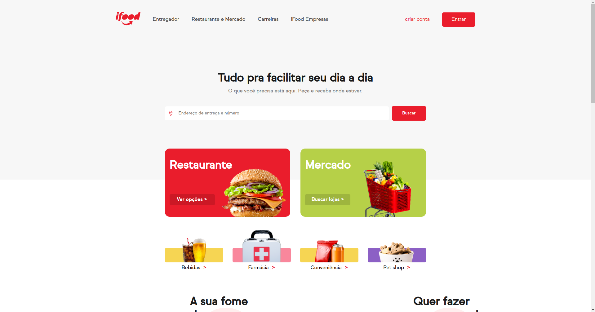

    <a href="https://miguelrisquelme.github.io/uiclone-ifood/" align="center">Clone</a> | <a href="https://www.ifood.com.br/" align="center">Official</a>  

<h1 align="center">UI Clone IFood</h1>

Olá este é um projeto feito para aplicar os conhecimentos obtidos nos cursos de Git, HTML, CSS da <a href="https://www.alura.com.br/">Alura</a>. Foram duas semanas de desenvolvimento onde pude aplicar conhecimentos mais avançados de CSS e utilizar corretamente as tags HTML5. O site tem imagens do próprio banco de imagens do iFood e também links para o site oficial, não o tornei responsivo da mesma forma que o site, além disso, também decidi não fazer algumas partes do site, então não é um clone fiel, AINDA!

 
 

## Preview Images

 
  
 

## Contribute

se você quiser contribuir neste projeto, basta seguir estes passos:

1. Faça uma bifurcação do projeto
2. Faça suas alterações
3. Abra uma solicitação pull

 
 

## O que está faltando?

Essas tarefas são problemas, podem ser encontradas aqui: <a href="https://github.com/PauloRicardo43?tab=repositories">Issues</a>

- 🟥 Restaurant sliders
- 🟥 Promotions slider
- 🟥 Side Menu
- 🟥 Animation on Restaurant and Market options
- 🟥 Modal over button "Entrar"
- ✅ Hover opacity in some links
- ✅ Transition size image on options

 
       

## References

- <a href="https://developer.mozilla.org/pt-BR/docs/Web/CSS/@font-face" target="_blank">Font Face CSS</a>
- <a href="https://www.eversondaluz.com.br/fixar-menu-no-topo-css" target="_blank">Fix Menu on Top</a>
- <a href="https://developer.mozilla.org/pt-BR/docs/Web/CSS/:not" target="_blank">Pseudo-class CSS :not()</a>
- <a href="https://jakearchibald.github.io/svgomg/" target="_blank">SVG Optimizer</a>
- <a href="https://developer.mozilla.org/pt-BR/docs/Web/CSS/:nth-child" target="_blank">Pseudo-class CSS :nth-child()</a>
- <a href="https://www.ifood.com.br/" target="_blank">iFood Website</a>
- <a href="https://www.w3schools.com/tags/tag_thead.asp" target="_blank">TAG thead</a>
- <a href="https://developer.mozilla.org/pt-BR/docs/Web/HTML/Element/aside" target="_blank">TAG article</a>
- <a href="https://developer.mozilla.org/pt-BR/docs/Web/HTML/Element/aside" target="_blank">TAG aside</a>
- <a href="https://web.fe.up.pt/~ee96100/projecto/Tabela%20ascii.htm" target="_blank">Tabela ASCII</a>
- <a href="https://cursos.alura.com.br/" target="_blank">Alura</a>

 
 

Developed by <a href="https://www.linkedin.com/in/paulo-ricardo-dev/"> Paulo Ricardo </a>
